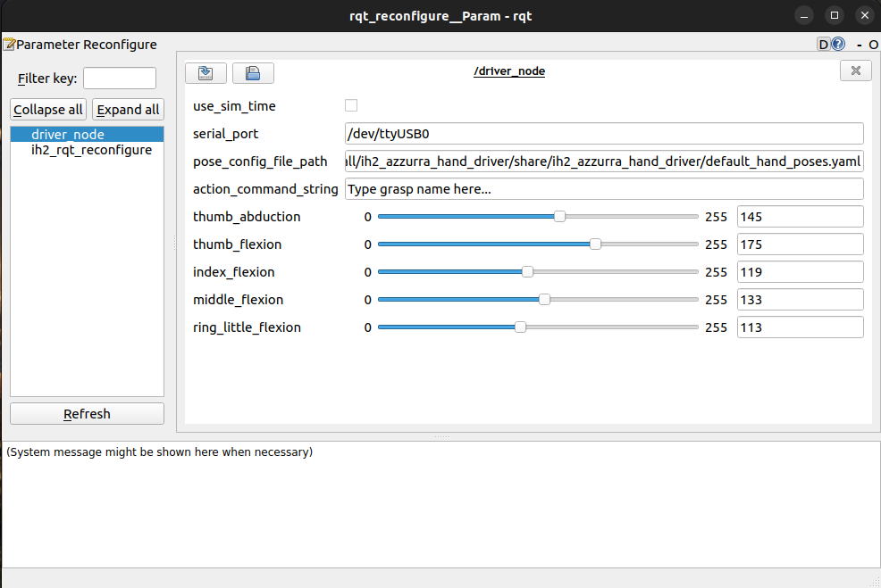

<div align="center">

A ROS package that exposes the control interfaces of the [Prensilia IH2 Azzurra Hand](https://www.prensilia.com/ih2-azzurra-hand/).

Designed for and tested on Ubuntu 22.04 LTS, ROS (2) Humble with Python 3.10.

<!-- Note on dev stage
-->
<b>Note: The package is in an initial development phase. It is unstable and may significantly change in concept and implementation.</b>
  
[](https://www.python.org/downloads/release/python-3100/)
[](https://opensource.org/licenses/MIT)

<b>Author:</b> [Ahmed Abdelrahman](https://github.com/af-a)

</div>

## Contents
- [➤ Overview](#overview)
- [➤ Installation](#installation)
- [➤ Usage](#usage)
- [➤ Directory Structure](#directory-structure)
- [➤ Dependencies](#dependencies)
- [➤ Future Plans](#future-plans)

## Overview

The <b>ih2_azzurra_hand_driver</b> enables controlling and tracking the state of a Prensilia IH2 Azzurra hand through a Python interfaces.

It can be built as a ROS-independent Python package, which contains the core functionalities, or optionally as a ROS2 Python package: a wrapper which adds ROS integration. In addition to implementing control through ROS actions, the ROS wrapper also adds a GUI through which the hand can be controlled.

## Installation

### Build Python Package

To build the standalone Python package, install with pip when located in the root directory:
```bash
pip3 install .
```

### Build ROS Package

To build the ROS package, clone the repository into your ROS workspace and build with:
```bash
colcon build --packages-select ih2_azzurra_hand_driver
```

When the ROS workspace is sourced after building, the Python module can also be imported and used as in the standalone Python build.

## Usage

### Python Driver

With the Python package installed and the hand connected through a USB connection, the driver can be initialized as follows:
```python
>>> from ih2_azzurra_hand_driver.ih2_hand_control import IH2AzzurraHandController
>>> hand_controller = IH2AzzurraHandController(serial_port='/dev/ttyUSB0')
>>> hand_controller.initialize()
```

<b>Note:</b> the value of `serial_port` may need to be adjusted.

The current pose (positions of each DoA motor) can be fetched by calling:
```python
>>> hand_controller.get_pose()
```

The pose can be set through:
```python
>>> hand_controller.set_pose([2, 46, 43, 19, 20])
```

<b>Note:</b> Following the convention of Prensilia, motor positions are encoded as an 8-bit integer (range (0, 255)), for flexion/extension or abduction/adduction (thumb).

### ROS Interface

To launch the driver node, run:
```bash
ros2 launch ih2_azzurra_hand_driver ih2_driver.launch.py
```

To execute a named hand pose from the set defined in [config/default_hand_poses.yaml](config/default_hand_poses.yaml), publish to the `/driver_node/action_command` as follows:
```bash
ros2 topic pub --once /driver_node/action_command std_msgs/msg/String '{"data": "open"}'
```

The launch file also starts an `rqt_reconfigure` GUI:
<p float="left" align="center">
  
</p>

A desired named pose can be executed by entering its name in the `action_command_string` field. In addition, the position if each of the five degrees of actuation (DoAs) can be individually controlled by modifying its value using the sliders or adjacent fields on the GUI.


## Directory Structure

<details>
<summary> Package Files </summary>

```
ih2_azzurra_hand_driver
│
├── ih2_azzurra_hand_driver
│   ├── __init__.py
│   ├── ih2_azzurra_control_node.py
│   └── ih2_hand_control.py
│
├── launch
│   └── ih2_driver.launch.py
│
├── config
├── LICENSE
├── package.xml
├── README.md
├── resource
├── setup.cfg
└── setup.py
```

</details>

## Dependencies

Python:
* `pyserial`
* `yaml`

ROS:
* `rclpy`
* `ament_cmake_python`
* `std_msgs`
* `action_msgs`
* `ih2_azzurra_hand_driver_interfaces`

## Future Plans

- [X] Add publishing of current hand information (joint angles, current, etc.) in standardized ROS messages
- [X] Add feature: read hand pose definitions from YAML files
- [X] Add feature: action interfaces for setting DoA positions
- [X] Add feature: a GUI plugin thtat exposes and enables control of variables

<!-- TODO: Add references, etc., if any
## Credits
* ...
 -->
